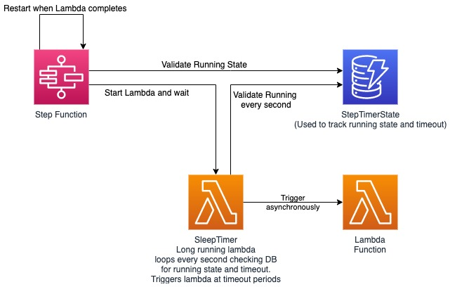

# Sub Minute Lambda Executor
When building applications in AWS developers may be required to poll external systems such as HTTP endpoints. Polling the external system faster than one minute may be required. External systems may also require adjustments to your polling pattern. Adjustments such as polling faster during the day and slower during the night. Typically, a developer would use a <a href="https://en.wikipedia.org/wiki/Cron">cron</a> style job scheduler to perform this task. Using AWS serverless services there is no current way to perform this action at a sub minute rate. Using <a href="https://aws.amazon.com/cloudwatch/">Amazon CloudWatch</a>, you are able to produce events at intervals of one minute or above, but does not allow for sub minute events. This solution will demonstrate how to use a set of services to produce events at a rate of one second or more in a highly accurate manor. The solution will show how to invoke an AWS Lambda function to poll the external systems at set intervals which can be adjusted over time.

### Architecture


1. <a href="https://aws.amazon.com/step-functions/">AWS Step Functions</a> are used to invoke a Lambda function which controls the final Lambda execution. The AWS Step Function will restart itself once the Lambda completes its execution.
1. <a href="https://aws.amazon.com/lambda/">AWS Lambda</a> is used to control the timing and final asynchronous execution of the worker Lambda which will perform the operation required for the external system.
1. <a href="https://aws.amazon.com/dynamodb/">Amazon DynamoDB</a> is used to store control flags such as if the system is running and also the interval at which the work Lambda should be invoked. 

### Requirements
* <a href="https://docs.aws.amazon.com/cdk/latest/guide/cli.html">AWS CDK Toolkit</a> (If rebuilding via CDK)

## Setup
There are 2 methods to install this sample as listed below either via the pre-generated CloudFormation template with inline Lambda functions or via CDK.
### CloudFormation
1. A CloudFormation template (SubMinuteLambdaExecutor.yaml) has been pre-generated and can be used directly
1. <a href="https://docs.aws.amazon.com/AWSCloudFormation/latest/UserGuide/cfn-console-create-stack.html">Follow the Creating a stack on the AWS CloudFormation console documentation</a>
1. During the <b>Selecting a stack template</b> step upload the SubMinuteLambdaExecutor.yaml file provided 
1. During the <b>Specifying stack name and parameters</b> step please update the "waitseconds" to the timeout required during setup
1. Complete the remaining steps from the documentation and wait for the stack to deploy
1. The outputs tab of the stack information will display the table name and arn, the Step Function name and arn, and the Lambda function names and arns
### CDK
1. From a terminal window at the root directory of this project do ```cdk deploy```
1. When complete, a list of outputs will display the table name and arn, the Step Function name and arn, and the Lambda function names and arns

## Running
1. To start the system either use the cli or console, start execution of the Step Function that was created.
1. The Step Function does not require any inputs

## Stopping Execution
1. To stop execution either use the cli or console, update the DynamoDB table column value "running" to false

## Resource Cleanup
### CloudFormation
1. Delete the CloudFormation stack

### CDK
1. From a terminal window at the root directory of this project do ```cdk destroy```

## Security

See [CONTRIBUTING](CONTRIBUTING.md#security-issue-notifications) for more information.

## License

This library is licensed under the MIT-0 License. See the LICENSE file.